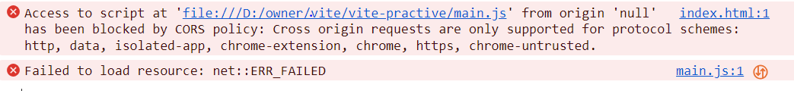
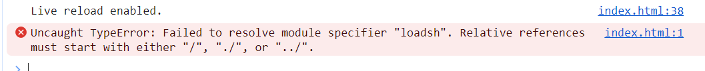

## script 配置type=module， 会导致引入的*.js 产生跨域，即使引入的是本地脚本文件也会跨域，对此现象， 最好的解释：https://blog.csdn.net/qq_43886365/article/details/131806887

## 如果我们在一个没有使用任何构建工具的项目中， 使用type=module引入*.js 文件, 并且在*.js 文件中使用 import _ from ‘lodash’, 这个时候浏览器console就会报下列错误，只需要引入vite，使用vite 启动项目就可以解决. 因为浏览器，不知道去node_modules 去搜索依赖， 而 vite 会帮我们启动一个服务器，从而解决这个问题。
    1. vite启动， 会以根目录下的index.html 为入口文件， 解析其中的script type=module 引入的源码， 这就是我们可以下载vite , package.json 中配置启动命令， 直接启动项目的原因
    2. 默认情况下， import 只能引入绝对路径和相对路径的包

## 为什么要进行依赖预构建？？
    1. 将不同规范（如 commonjs）的依赖转化成esmodule规范，
    2. 提高后续页面的加载性能，将那些具有许多内部esm模块的依赖转换成单个模块进行加载，避免浪费浏览器性能，（ 如    lodash-es 模块）

## 定义环境变量
    1. 首先，定义环境变量的文件， vite 使用的dotenv, 会自动到根目录下加载指定的环境变量的文件， 并挂在到process.env 中
        1. .env,   // 在任何情况下都会加载
        2. .env.development, // 在开发环境下 加载
        3. .env.production， // 在生产环境下 加载
    2. 相关环境变量的文件定义好后， 并不能从process.env 中获取到定义的环境变量，我们还需要使用vite 提供的 loadEnv 函数来将环境变量的并入process.env中， loadEnv 返回的就是整个process.env, 这个时候可以在server 端 获取到
        1. loadEnv(mode, envDir, prefixes); 
        2. mode是只开发还是生产环境， envDir 是加载env文件的路径， prefixes是指暴漏在生产环境下环境变量的前缀，默认是VITE_
    3.  在client端代码， vite 为了防止一些私密的变量暴露， 就做了变量区分， 只有VITE_ 开头的变量才能在client 端被获取， 也可以在viteConfigjs 中通过envPrefix 更改VITE_ 为任意字符串
## loading